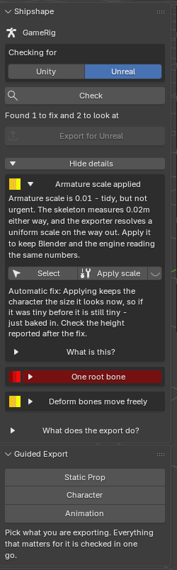

Shipshape Validator is out. It is a Blender add-on that checks a rig or mesh
before you export it to Unreal or Unity, and tells you in plain language what
will break.

## Why I built it

You export an FBX, import it into the engine, and the character is 2cm tall,
lying on its side, grey with no textures, or will not animate. The engine gives
you no useful error. So you go back to Blender and guess.

That loop is the whole problem. After enough years of it I wanted something
that catches the cause while the file is still open in front of me.

## What it actually does

Select your character, press Check, and you get a list. Red will break the
export, yellow is worth a look, green means done. Every finding says what is
wrong in a sentence with the number that matters -- "3 bones sit at the top
with no parent" -- and most of them offer a fix.

Twenty-five checks across the skeleton, mesh, weights and materials. It knows
Rigify and Game Rig Tools setups specifically, so it finds the rig you actually
export rather than the control rig.

There is also a symptom-first mode. Already imported it and it looks wrong?
Pick what you can see from a list and it shows which checks cause that, then
runs them on your file.

## The part I care most about

Every automatic fix tells you what it does **not** promise. Applying scale
keeps the character the size it currently looks, so if it was tiny, it is still
tiny -- just baked in. The tool says so, next to the button and again after it
runs.

And a warning can be wrong. Some rigs break the rules on purpose. Mark the
finding intentional and it stops nagging, but it stays listed rather than
being silently hidden.

If it flags your rig and your rig is fine, I want to hear about it. Several
real bugs were found exactly that way.

[Read the documentation](../shipshape.html) or
[get it on Superhive](https://superhivemarket.com/products/shipshape-validator).
